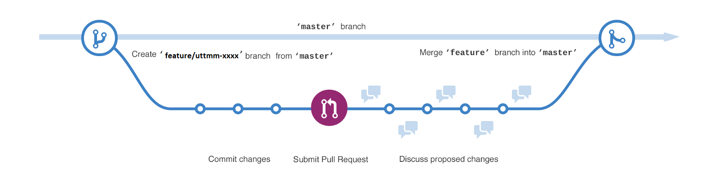

# TheraLang
Platform for social lang therapy projects

## Git Flow
We are using simpliest github flow to organize our work:

We have only **master** and **feature** branches. 
After each sprint we are creating **tag** with release version using semantic versioning (X.X.X):
https://semver.org/

## How to run application 
1. Clone it from git hub with $ git clone https://github.com/yrikturash/TheraLang.git
2. If you have MS SQL in your local machine go to step 4, else to 3
3. Download MS SQL from [Download MS SQL](https://www.microsoft.com/en-us/sql-server/sql-server-downloads)
4. In project TheraLeng.Web create file appsetings.json
5. Create here your loca DB with connection string
6.If you dont have node.js on your local machine download it from [Download Node.js] (https://nodejs.org/uk/) 
7. In file data/Piranha.Data.EF/Db.cs change 160 row to "Database.Migrate();" (only for first run)
8. And run project

**Note! Contribution rules:**
1. All the commits should start from prefix *uttmm-xxx* and have a short and clear description what was done. Where *xxx* - number of the ticket. In case of subtask - *uttmm-xxx-yyy*, where *yyy* - number of the subtask.
i.e. uttmm-4510 Added tests for GetOffers method.
2. Pull request should not contain any files that is not required by task.
In case of any violations, pull request will be rejected.
